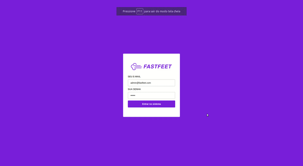

<h1 align="center">
  
</h1>

<h3 align="center">
  FastFeet Fullstack app
</h3>


<p align="center">Application for studying purposes </p>

---

<p align="center">
  
  
  
  

</p>

<p align="center">
  <a href="#project">Project</a>&nbsp;&nbsp;&nbsp;|&nbsp;&nbsp;&nbsp;
  <a href="#technologies">Technologies</a>&nbsp;&nbsp;&nbsp;|&nbsp;&nbsp;&nbsp;
  <a href="#how-to-run">How to run</a>&nbsp;&nbsp;&nbsp;|&nbsp;&nbsp;&nbsp;
  <a href="#licence">Licence</a>
</p>




## 👨🏻‍💻 Project

This Project is a simplified version of an delivery application.

**Backend:** its a **Node.js** RESTful API used to handle all the logic and interations with our databases, delivering to our interfaces JSON elements with the needed data on the frontend and mobile

**Frontend:** a **ReactJS** application made to the Admin manage all the Orders, Recipients and Deliverymen subscribed to the application

**Mobile:** a **React Native** application made for *iOS* and *Android* that's responsible for the Deliveryman see and change his deliveries
## 🚀 Technologies

Some of the Technologies involved in this project:

* Node.js
* ReactJS
* React Native
* Redux
* Redux-Saga
* Redux-persist
* Styled-components
* Yup
* @rocketseat/Unform
* React-toastify
* React Navigation @5.x
* ESLint
* Prettier
* React Icons
* BcryptJS
* JSON Web Token
* Bee-queue
* Sentry
* VsCode

<div id="how-to-run"> </div>

### 🏃🏻‍♂️ How to run 

#### Requirements

You will need:
* Git
* NodeJs
* Yarn
* Docker (or have running instances of **Redis:alpine** and **PostgreSQL**)
* Reactotron (For better debugging)
* Android Studio


#### Databases:

I recommend using Docker images for the databases, since its simple to configure it.
Add the following images to your docker containers:

```bash
#  install Postgres Image
$ docker run --name imageName -e POSTGRES_PASSWORD=YourPassword -p 5432:5432 -d postgres

#  start postgres image
$ docker start imageName

#  install Redis Image
$ docker run --name imageName -p 6379:6379 -d -t redis:alpine

#  start redis image
$ docker start imageName
```

After that, clone the repository in your computer

```git
git clone https://github.com/matheuslenke/Desafio-Final-Fastfeet.git
```

#### 💻Backend:

Now you need to configure the **environment variables** of your backend, so you can access all databases with the node.js server.
Go to **./backend/.env.example** and fill with you data. For now, you don't need to insert **SENTRY_DNS** and you can use mailtrap.io to test e-mail features

After that, you can go to `~/backend` and execute:
```bash
$ yarn

# Script to start the development server
$ yarn dev && yarn queue
```
You can also use another port for your server going to ~/backend/src/server.js and changing the port inside `app.listen(PORT)`


Now, you need to run the database migrations in the docker components you configured. For that, just go to `~/backend` and execute:

```bash
$ yarn sequelize db:migrate

$ yarn sequelize db:seed:all

# in case you did something wrong, try to
$ yarn sequelize db:migrate:undo:all
```


#### 🖥Frontend:

Similar to our backend, just go to `~/frontend` and execute:
```bash
$ yarn

# Script to start the development server
$ yarn start
```

The React application will be mounted in your `http://localhost:3333`

#### 📱Mobile:

> This application was fully tested only on Android

Finally, to run the mobile application, go to `~/mobile` and execute:


##### Android:
```bash
$ yarn

# In case you are using an android Emulator, to Reactotron works
$ adb reverse tcp:9090 tcp:9090 
$ adb reverse tcp:3333 tcp:3333

# To android run via USB
$ adb reverse tcp:8081 tcp:8081


$ react-native run-android
```

* if you are running via USB, don't forget to go into `~/config/ReactotronConfig.js` and insert your machine ip in .configure: `.configure({url: 'Your Machine IP'})`, and to go to `~/services/api` and change baseUrl to your machine ip too

* if you are using an android emulator, using `10.0.2.2` as baseURL in these configs should work

##### iOS:

**Only if you are using MacOS**

```bash
$ yarn

$ cd ios

$ pod install

$ cd ..

# you can use the --simulator="iPhone 11" to run another version of iPhone if you are in MacOS
$ react-native run-ios
```


Now you can start testing or programming. Have Fun!

---


### Extra info

This project was developed for studying purposes and its the final challenge of <a href="https://rocketseat.com.br/gostack"> Rocketseat's bootcamp goStack 10.0 </a>


<div id="licence"> </div>

### 📝 Licence

This project is under MIT License. See the file [LICENSE](LICENSE.md) for more details.

---

Made with :purple_heart: by Matheus Lenke